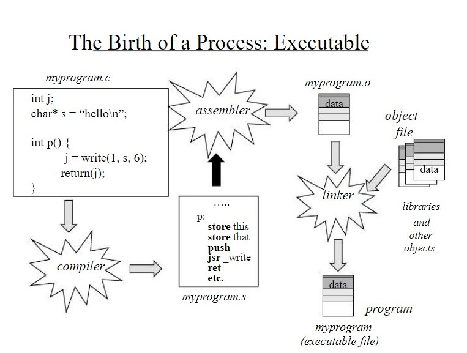

## [Week 2 | Programs and Processes](Week2.md)
### What is a process? 
an executing program or a container for computing resources
### What is the structure of C programs? 
every C program consists of a collection of C:
- functions
- types
- variable declarations (structs, arrays, typedefs)
- one function has to be called in main
  - `int main (int argc, char *argv[])`
  - `argc` is the # of command line arguments (min 1)
  - `argv` is an array of argc strings including the program name
- types of ways to declare strings in C
  - `typedef char *string; // VERY careful `
  - `typedef char [] string = “abc...”; // string literal`
  - `typedef char [MaxLength] string; // VERY careful`
### Type conversions
```
int x;
x = atoi(argc[i]); // string to int
y = x + 10;
```
### Program Structure Style
- C program constains a set of modules
  - separate files are compiled separately
  - each file contains functions
  - common types, data structures, and function prototypes are in header files

### Global and Local scoping\
`static int x` 
- allocated and available only to the file containing its declaration
- deallocated after OS unloads the program (lifetime of variable is lifetime of program)

`int x`
- allocated globally and exportable to any module
- generally deallocated at the end of the block of code that it is declared

`extern int x`
- allocated elsewehre
- the allocation (int x) must be linked in eventually

*NOTE:* global variables are deallocated with the program
### Libraries and include files
- when invoking a function, the compiler needs a signature (or prototype) for it
- usually functions are in standard libraries (`<stdio.h>` for example)
- if not, you use `-l<library-name>`
- `stdio` libraries are linked in by default
### How to compile
- use gcc compiler
- command to compile is
  - `gcc -o executable executable.c`
- there are other options like `-v` for verbose or `-c` but we usually use `-o`
### Error handling
example: basic error handling
```
#include <unistd.h>
// -1 returned if failure
// sets errno(extern int)
int close(int fildes);

if(close(fildes) == 01) {
    perror("close files"); // uses errno
}
```
*NOTE:* generally it's good style to check for errors in system calls
### How 0 is represented in C
- NULL is same as 0 
- NULL is also used to refer to a 0 pointer in C and Unix
- we can use `#defne NULL 0`
- a NULL character that terminates a string `\0` has ascii value of 0
- if a system call takes an int flag, 0 is usually a safe default
- 0 is also a logical not (like 0 = false)

### CSCI 2021 C review
- see slides to review
  - memory allocation
  - pointers
  - parameter passing
  - memory leakage
    - segmentation fault
- use debuggers such as
  - GNU debugger
  - valgrind or splint

example: buffer overflow/stack smashing
```
void func(char *buffer, ...) {
    char local[5];
    // string copy ... copies until `\0`
    strcpy(local, buffer);
    // local[0] = buffer[0];
    // local[i] = buffer[i];
}
```
what's the issue here? 
- if you call this function with a big string, you "clobber" the stack
- local variables and possibly the return address of the call may be overwritten
- best case the program dies
- !!!possible solution to this

---
### Processes as an abstraction
process oeprations involve
- create: `fork`
- change: `exec`
- terminate: `exit/abort/return` signals
- synchronize: `wait*` and others
**visualize how process goes from program to executable**

### Some unix processes are
- process trees
- process creation: `fork/exec`
- synchronization/control: `wait`
- termination: `exit`
- error handling
- identities

- processes in unix form a hierarchy
  - root is `systemd` which is started by the OS
  - children are created by parents
  - the Unix shell is a child of `systemd` and the shell in turn creates other processes
  - when YOU log in, a process (your shell) is created and running
    - it has an associated terminal window for I/O
    - it's a foreground process and allows you to interact with it
    - example: foreground process: shell waits for completion + user can interact with process
  - example: background process: shell doesn't wiat for program to complete before next prompt and the user can't interact with background process

#### Switching from foreground to background
- `<loop>`
- `^z` to suspend a process and get control back
- `bg` to run it in the background
- `fg` to run it in the foreground
- `jobs`: lists job ids (not same as process ids) in current shell only
  - `tops and ps` in comparison list job ids machine wide

### Forking
- unix system call for process creation is called `fork()`

example: simple fork
```
#include <sys/types.h>
#include <unistd.h>
pid_t fork(); // pid_t is a process id #

```
- with any unix system call you need error codes, header files, paramters
- fork system call creates a clone of the parent process
- this clone is called the child process
  - child has a copy of the parent's virtual address space (memory)
    - which is a virtual copy using copy-on-write
  - child is running the same program code as the parent
  - child begins life with the same register values of the parent
  - child inherits resources from the parent
- so what is not shared between child and parent? 
  - locks, IDs, signals, CPU time measures, and more

### Waiting
example: make parent process wait until child exits
```
#include <syswait.h>
pid_t wait(int *stat_loc); // wait for any child
pid_t waitpid(pid_t pid, int *stat_loc, int options); // wait for a specific child
```
some important definitions:
`stat_loc` 
- either NULL or 0, shows if child exited
- if stat_loc isn't NULL you have to allocated it
- two ways to do this are:
` wait(NULL);`
or
```
int stat_loc;
wait(&stat_loc); // output parameter
```
### How might forking fail? 
- when there are too many processes in the system
- there's not enough memory
- not enough disk space

### Exec
- we use this when we want a child process to execute a different program
- it completely overwrites the child's memory
  - only exception is ID (pid) are intact as well as I/O, descriptors, and the env

```int execl(const char *path, const char *arg0, const char *arg1, (char *) 0);`
there is a family of options for exec functions:
- `execl`
- `execlp`
- `execv`
- `execvp`
- `execve` = most general form

### How might exec fail? 
- wrong path

### How does a process terminate
- return from main
- fall of the end of `main`
- call `exit`
- call `abort`
- receivd a death signal or exception: `kill(pid_t pid, SIGKILL)`

extra notes about process termination
- should be orderly
  - the child should terminate before the parent and the parent should wait
- what happens if the parent doesn't wait for the child to terminate? 
  - you get **zombies**
  - the child becomes a zombie and the OS keeps it around long enough until the parent does a wait to get exit status or until the parent exits
- what happens if the parent exits whiel the child is running? 
  - the child becomes an **orphan**
  - this isn't a hugge issue since children become adopted by another parent up the tree
  - sometimes `systemd` adopts these orphans
